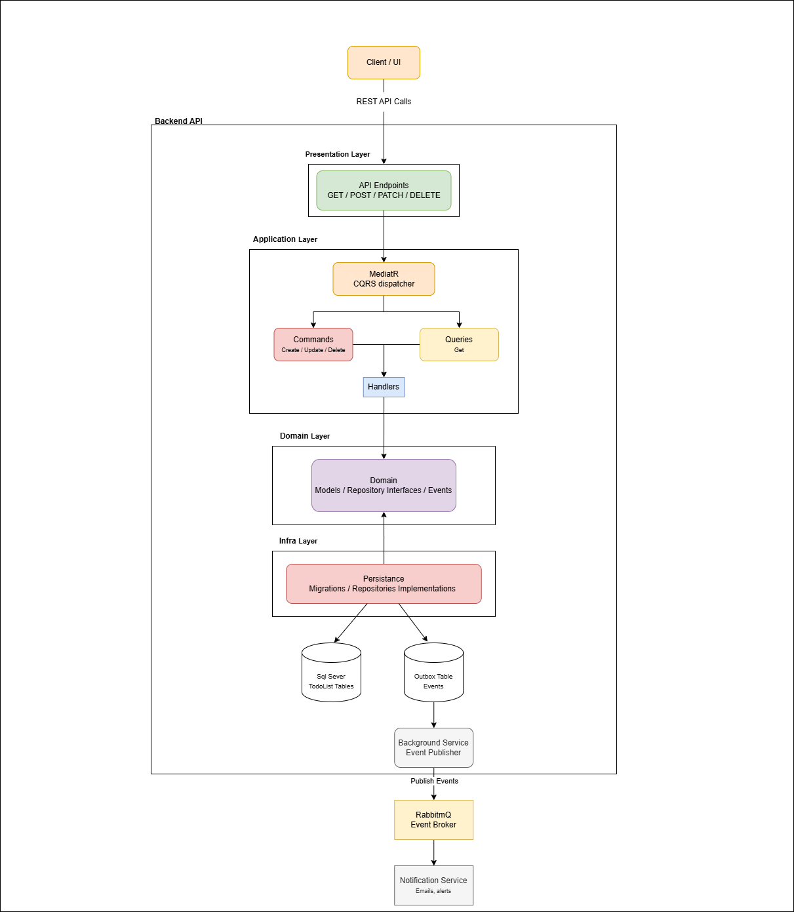

# ToDoList API

A classic To-Do List micro-application built with **.NET 8 Web API** and **C#**, following **DDD**, **CQRS** (via MediatR), **IoC**, and **EF Code-First** design patterns. Includes an Outbox pattern for reliable event publishing to RabbitMQ and a separate Notification Worker Service.

---

## Architecture



The application follows a layered architecture:

- **Presentation Layer** — REST API endpoints (GET / POST / PATCH / DELETE)
- **Application Layer** — MediatR CQRS dispatcher, Commands, Queries, Handlers
- **Domain Layer** — Domain models, repository interfaces, domain events
- **Infrastructure Layer** — EF Core persistence, migrations, repository implementations, RabbitMQ publisher, Outbox background service
- **Notification Service** — RabbitMQ consumer that handles events

---

## Projects (`ToDoList.sln`)

| Project                        | Type           | Role                                                                           |
| ------------------------------ | -------------- | ------------------------------------------------------------------------------ |
| `ToDoList.Domain`              | Class Library  | Entities, repository interfaces, domain events                                 |
| `ToDoList.Application`         | Class Library  | MediatR commands, queries, handlers, DTOs                                      |
| `ToDoList.Infrastructure`      | Class Library  | AppDbContext, EF configs, repositories, RabbitMQ publisher, background service |
| `ToDoList.API`                 | Web API        | Controllers, Program.cs, IoC wiring, Swagger                                   |
| `ToDoList.NotificationService` | Worker Service | RabbitMQ consumer, notification handlers                                       |

### Project Reference Chain

```
ToDoList.API
├── ToDoList.Application
│   └── ToDoList.Domain
└── ToDoList.Infrastructure
    └── ToDoList.Domain

ToDoList.NotificationService
└── ToDoList.Domain
```

---

## Tech Stack

| Concern         | Technology                         |
| --------------- | ---------------------------------- |
| Framework       | .NET 8 Web API                     |
| ORM             | Entity Framework Core (Code-First) |
| CQRS Dispatcher | MediatR                            |
| Database        | SQL Server                         |
| Message Broker  | RabbitMQ                           |
| API Docs        | Swagger / Swashbuckle              |

---

## Getting Started

### Prerequisites

- [.NET 8 SDK](https://dotnet.microsoft.com/download)
- SQL Server (local or remote)
- RabbitMQ (e.g. via Docker: `docker run -d -p 5672:5672 -p 15672:15672 rabbitmq:management`)

### Run

```bash
# Apply EF migrations
dotnet ef database update -p ToDoList.Infrastructure -s ToDoList.API

# Start the API
dotnet run --project ToDoList.API

# Start the Notification Worker
dotnet run --project ToDoList.NotificationService
```

Swagger UI will be available at `https://localhost:{port}/swagger`.

---

## Database Schema

```dbml
// Use DBML to define your database structure
// Docs: https://dbml.dbdiagram.io/docs

table TodoListItem {
  ID Guid [primary key]
  TodoListID Guid [not null, ref: > TodoList.ID]
  Title varchar [not null]
  Description text [null]
  Priority int [not null, default: 0, note: '0=Low, 1=Medium, 2=High']
  IsCompleted bool [not null, default: false]
  CreatedAt datetime [not null]
  DueDate datetime [null]
  CompletedAt datetime [null]
}

table TodoList {
  ID Guid [primary key]
  Title varchar [not null]
  IsCompleted bool [not null, default: false]
  OwnerID Guid [not null, ref: > User.ID]
  CreatedAt datetime [not null]
  CompletedAt datetime [null]
  DueDate datetime [null]
}

table User {
  ID Guid [primary key]
  Username varchar [unique, not null]
  CreatedAt datetime [not null]
  Email varchar [unique, not null]
}

table Outbox {
  ID Guid [primary key]
  EventType varchar [not null]
  Payload text [not null]
  OccurredOn datetime [not null]
  ProcessedOn datetime [null]
  AggregateId Guid [not null]
  AggregateType varchar [not null]
  RetryCount int [not null, default: 0]
  Error text [null]
}
```

### Relationships

- **User → TodoList**: one user owns many lists (`OwnerID`)
- **TodoList → TodoListItem**: one list has many items (`TodoListID`)
- **Outbox**: standalone — stores serialized domain events for async RabbitMQ publishing
